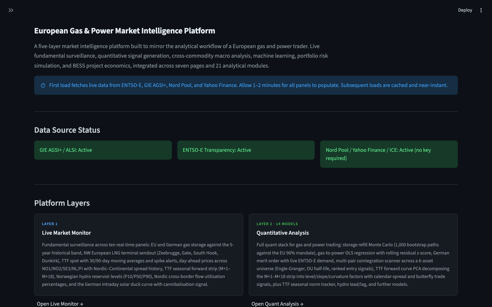
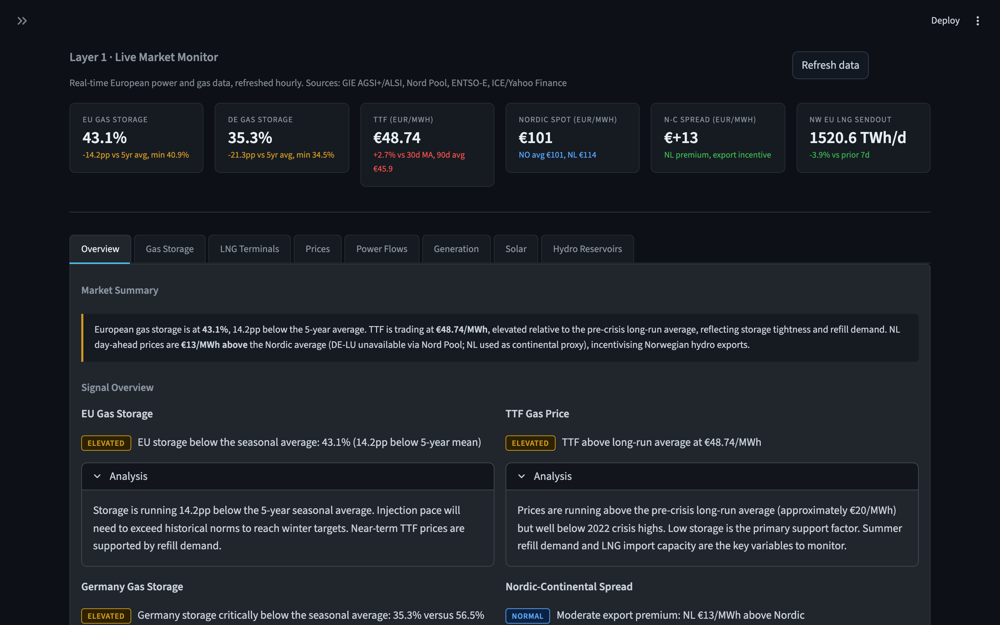
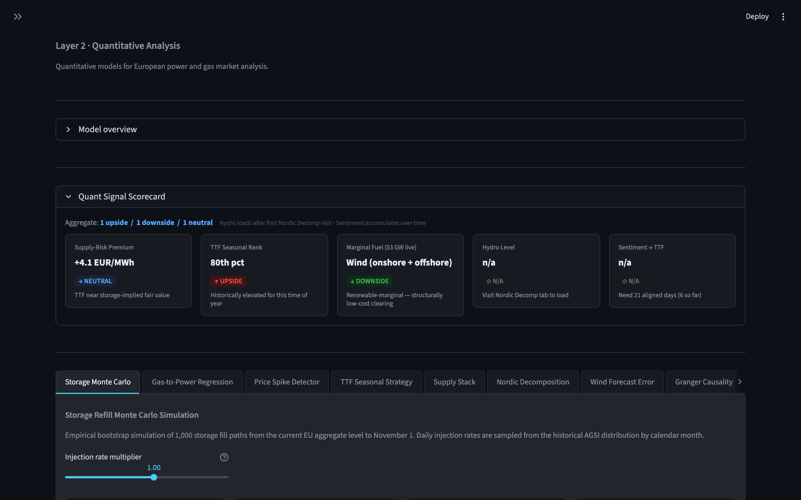
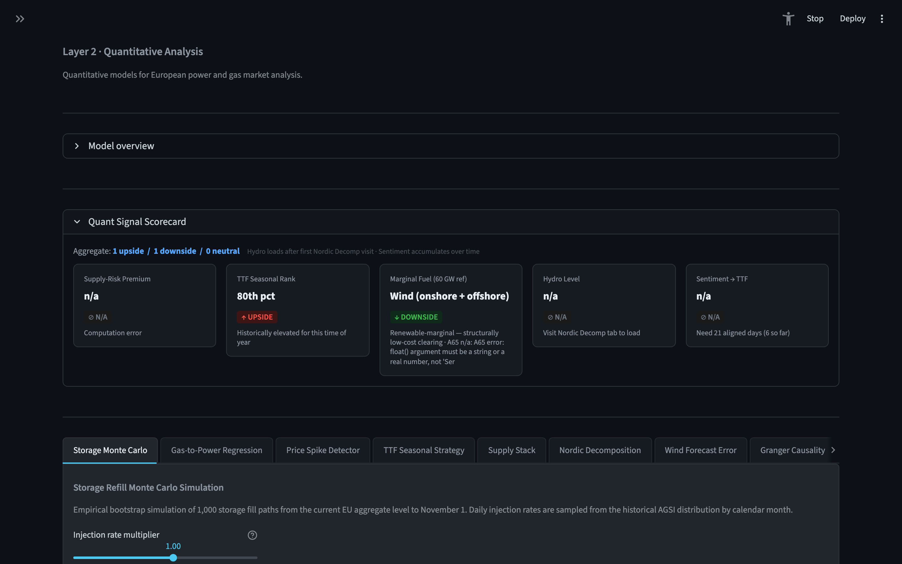
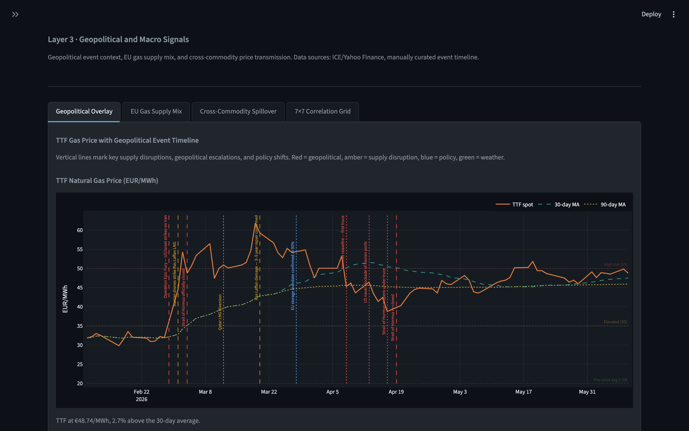
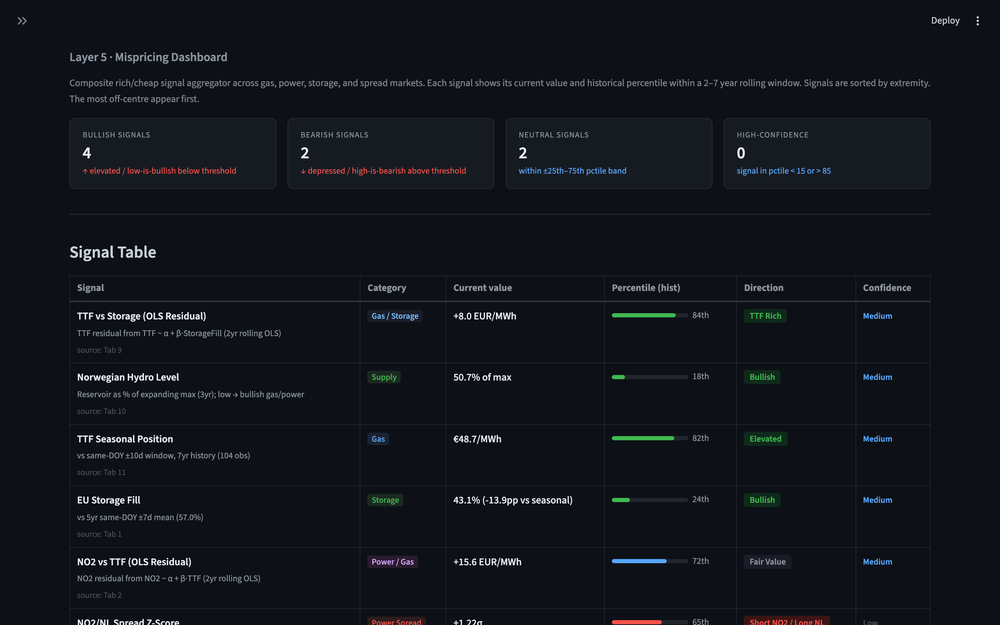
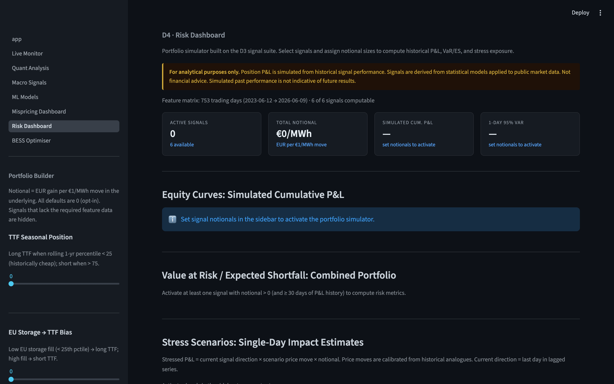
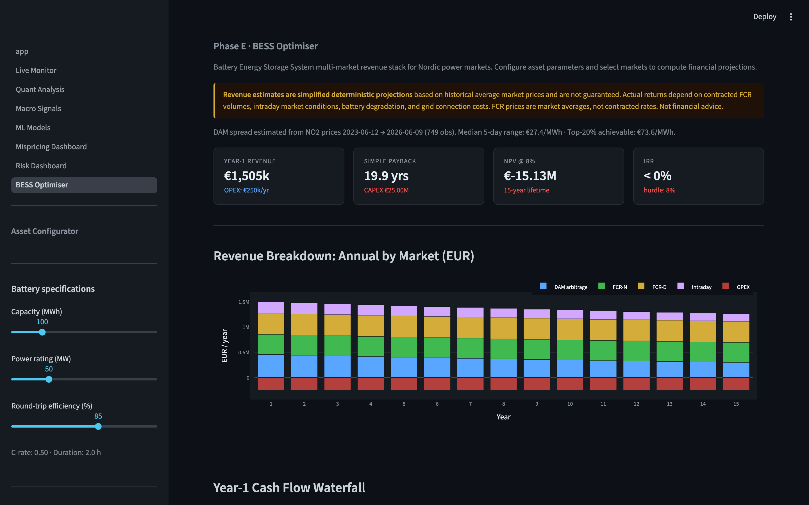

# European Gas and Power Market Intelligence Platform

**A five-layer quantitative analytics platform built to mirror the analytical workflow of a European physical energy trader.**

[](https://huggingface.co/spaces/TobGud/power-trader-portfolio)
[](https://www.python.org/)


The platform integrates live fundamental data from ENTSO-E Transparency, GIE AGSI+/ALSI, Nord Pool, and ICE/Yahoo Finance into a unified analytical environment covering storage balances, forward curve dynamics, cross-commodity price transmission, machine learning regime detection, portfolio risk simulation, and battery storage project economics. All models are implemented from scratch in Python; no third-party signal providers or data vendors are used beyond the public API layer. The architecture escalates from raw market observation in Layer 1 to actionable composite signals in Layer 5, following the analytical hierarchy a physical desk would apply before taking a position.

---

## Headline Results

The following are representative outputs from the platform as computed on current market data. All figures are reproducible by running the platform against live feeds; the underlying methodology is verifiable in the linked source files.

| Module | Result | Source |
|--------|--------|--------|
| Nordic Price Decomposition (Layer 2) | R² = 0.79 over rolling 90-day window; continental price (NL) coefficient 23.83 EUR/MWh per σ, dominant driver in gas-marginal regime | [models/nordic_decomp.py](models/nordic_decomp.py) |
| Storage Refill Monte Carlo (Layer 2) | P50 terminal fill and probability of meeting EU 90% mandate computed across 1,000 bootstrap paths from current AGSI fill level, calibrated from 5 years of daily injection history | [models/storage_monte_carlo.py](models/storage_monte_carlo.py) |
| TTF Seasonal Strategy Backtest (Layer 2) | Full-sample hit rate 43%; ex-crisis average P&L +0.7 EUR/MWh; Sharpe computed across gas years 2018-2026 | [models/ttf_backtest.py](models/ttf_backtest.py) |
| Multi-Pair Cointegration Scanner (Layer 2) | 6-asset universe (NO2, NL, TTF, DE, FR, NBP); all pairs ranked by Engle-Granger p-value, Ornstein-Uhlenbeck half-life, and real-time z-score entry signal | [pages/2_Quant_Analysis.py](pages/2_Quant_Analysis.py) |
| Forward Curve PCA (Layer 2) | PC1 (level) explains approximately 85-90% of M+1-M+18 panel variance; PC2 (slope/storage carry) and PC3 (curvature) generate calendar-spread and butterfly trade signals when z-score exceeds ±2σ | [pages/2_Quant_Analysis.py](pages/2_Quant_Analysis.py) |
| 7x7 Cross-Commodity Correlation Grid (Layer 3) | 90-day rolling Pearson ρ(TTF, Brent) approximately +0.59; ρ(copper, aluminium) approximately +0.45; lead-lag sweep ±10 days across all 21 pairs | [pages/3_Macro_Signals.py](pages/3_Macro_Signals.py) |
| D4 Risk Dashboard (Page 6) | 95% and 99% 1-day VaR and Expected Shortfall via non-parametric bootstrap on 6-signal portfolio; 4 named stress scenarios (cold snap, Norwegian outage, Hormuz extension, EUR/USD shock) | [pages/6_Risk_Dashboard.py](pages/6_Risk_Dashboard.py) |
| BESS Optimiser (Page 7) | NPV, IRR (bisection method), and simple payback for Nordic BESS across DAM arbitrage, FCR-N (EUR 8,000/MW/yr), and FCR-D (EUR 12,000/MW/yr); sensitivity table across ±20% CAPEX, FCR prices, and energy spread | [pages/7_BESS_Optimiser.py](pages/7_BESS_Optimiser.py) |

---

## Live Demo

**Primary deployment:** [huggingface.co/spaces/TobGud/power-trader-portfolio](https://huggingface.co/spaces/TobGud/power-trader-portfolio)

The HuggingFace Space builds from the `hf-deploy` branch. Cold-start on an idle Space takes approximately 90 seconds while the container builds and live data fetches complete. All panels degrade gracefully without API keys: the TTF price, Nord Pool spot prices, forward curve, and commodity correlations load without credentials. Gas storage, ENTSO-E flows, hydro, solar, and generation data require free API keys from GIE and ENTSO-E (registration links in the app sidebar).

A Docker-based Render deployment (EU Frankfurt, persistent disk for FinBERT sentiment history) is configured via [Dockerfile](Dockerfile) and [render.yaml](render.yaml).

<details>
<summary>Landing page</summary>



</details>

<details>
<summary>Layer 1: Live Market Monitor</summary>



</details>

<details>
<summary>Layer 2: Quantitative Analysis</summary>



</details>

<details>
<summary>Layer 2: Forward Curve PCA</summary>



</details>

<details>
<summary>Layer 3: Geopolitical and Macro Signals</summary>



</details>

<details>
<summary>Layer 5: Mispricing Dashboard</summary>



</details>

<details>
<summary>Page 6: Risk Dashboard</summary>



</details>

<details>
<summary>Page 7: BESS Optimiser</summary>



</details>

---

## Architecture

```
                    ┌─────────────────────────────────────────────────────┐
                    │  DATA LAYER                                          │
                    │  ENTSO-E A44/A65/A69/A75/B09/B16/B19/B31            │
                    │  GIE AGSI+ · GIE ALSI · Nord Pool · ICE/Yahoo        │
                    │  Fraunhofer ISE · FinBERT RSS                        │
                    └───────────────────────┬─────────────────────────────┘
                                            │
          ┌─────────────────────────────────▼──────────────────────────────────┐
          │  Layer 1: Live Market Monitor                                       │
          │  EU/DE gas storage · LNG sendout · TTF spot + forward strip        │
          │  Nord Pool day-ahead · Norwegian hydro · Cross-border flows        │
          │  German solar duck curve · Coal dispatch (fuel switching)           │
          └─────────────────────────────────┬──────────────────────────────────┘
                                            │
          ┌─────────────────────────────────▼──────────────────────────────────┐
          │  Layer 2: Quantitative Analysis  (14 models)                       │
          │  Storage Monte Carlo · Gas-Power OLS · Spike detector              │
          │  TTF seasonal strategy · Supply stack (merit order)                │
          │  Nordic decomposition · Wind forecast error · Granger causality    │
          │  Storage-price OLS · Hydro lead/lag · Seasonal norm                │
          │  NO2/NL cointegration · Multi-pair scanner · Forward curve PCA     │
          └─────────────────────────────────┬──────────────────────────────────┘
                                            │
          ┌─────────────────────────────────▼──────────────────────────────────┐
          │  Layer 3: Geopolitical and Macro Signals  (4 panels)               │
          │  TTF + 19-event geopolitical timeline · EU supply mix 2020-2026   │
          │  Gas-fertiliser-food spillover chain · 7x7 cross-commodity grid   │
          └─────────────────────────────────┬──────────────────────────────────┘
                                            │
          ┌─────────────────────────────────▼──────────────────────────────────┐
          │  Layer 4: Machine Learning  (3 models)                             │
          │  PyTorch LSTM forecaster (64-32 units, honest baseline check)      │
          │  4-state Gaussian HMM regime classifier                            │
          │  FinBERT news sentiment + Granger causality vs TTF returns         │
          └─────────────────────────────────┬──────────────────────────────────┘
                                            │
          ┌─────────────────────────────────▼──────────────────────────────────┐
          │  Layer 5: Mispricing Dashboard  (8-signal composite scorecard)     │
          │  TTF seasonal · EU storage · NO2/NL spread · Gas-power residual   │
          │  Clean spark spread · Norwegian hydro · TTF vs storage · Fuel sw. │
          └─────────────────────────────────┬──────────────────────────────────┘
                              ┌─────────────┴─────────────────────────┐
                              │                                       │
          ┌───────────────────▼────────────────────────────┐  ┌─────────────────▼───────────────┐
          │  Page 6: Risk Dashboard                        │  │  Page 7: BESS Optimiser         │
          │  VaR/ES bootstrap (1,000 paths)                │  │  DAM + FCR-N/D revenue          │
          │  4 named stress scenarios                      │  │  NPV / IRR / payback            │
          │  Rolling correlation matrix                    │  │  ±20% sensitivity table         │
          └────────────────────────────────────────────────┘  └─────────────────────────────────┘
```

The layered model reflects how a physical desk processes information: raw observation (Layer 1) feeds quantitative model estimation (Layer 2), which contextualises within the macro and geopolitical regime (Layer 3), cross-validates against statistical learning signals (Layer 4), and synthesises into a ranked composite view (Layer 5). Pages 6 and 7 apply that signal infrastructure to portfolio risk and project evaluation respectively.

---

## Module Catalogue

| Module | Layer / Page | Methodology | Citation / File |
|--------|-------------|-------------|-----------------|
| Gas Storage Monitor | Layer 1 | GIE AGSI+ EU/DE fill vs 5-year seasonal band (min/mean/max/P10/P90) | [data/gas_storage.py](data/gas_storage.py) |
| LNG Terminal Sendout | Layer 1 | GIE ALSI daily sendout aggregation across Zeebrugge, Gate, South Hook, Dunkirk; WoW change alert at -15% | [data/lng_terminals.py](data/lng_terminals.py) |
| TTF Spot + Forward Strip | Layer 1 | ICE TTF front-month via Yahoo Finance; MA30/MA90; synthetic M+1-M+18 strip from historical seasonal index | [data/prices.py](data/prices.py), [data/forward_curve.py](data/forward_curve.py) |
| Nordic Day-Ahead Prices | Layer 1 | Nord Pool public API; NO1/NO2/SE3/NL/FI; 365-day history; NL-NO2 spread; Norwegian zonal (NO1-NO5 vs SYS) | [data/spot_prices.py](data/spot_prices.py) |
| Norwegian Hydro Reservoirs | Layer 1 | ENTSO-E B31 weekly aggregate for Norway (EIC: 10YNO-0--------C); P10/P50/P90 percentile bands | [data/hydro.py](data/hydro.py) |
| Nordic Cross-Border Flows | Layer 1 | ENTSO-E B09/B10 physical flows: NordLink (1,400 MW), NorNed (700 MW), NSN (1,400 MW), Skagerrak (1,700 MW); daily utilisation % | [data/power_flows.py](data/power_flows.py) |
| German Solar Duck Curve | Layer 1 | ENTSO-E B16 (primary); Fraunhofer ISE energy-charts.info (fallback); hourly mean over 14-day window; cannibalisation signal | [data/solar.py](data/solar.py) |
| German Coal Generation | Layer 1 | ENTSO-E A75; hard coal + lignite quarterly TWh and 90-day daily trend; fuel-switching indicator at TTF > 50 EUR/MWh | [data/generation.py](data/generation.py) |
| Storage Refill Monte Carlo | Layer 2 | Empirical bootstrap, 1,000 paths; daily injection draws by calendar month from 5-year AGSI history (no look-ahead); P10/P25/P50/P75/P90 fan chart | [models/storage_monte_carlo.py](models/storage_monte_carlo.py) |
| Gas-to-Power OLS Regression | Layer 2 | OLS of NL day-ahead on TTF; expanding-window residual z-score; R² as regime indicator (low R² = renewables-marginal) | [models/gas_power_regression.py](models/gas_power_regression.py) |
| Price Spike Detector | Layer 2 | Rolling 30-day z-score across NO1/NO2/SE3/NL/FI; alert threshold |z| > 2.5, warning |z| > 1.5 | [models/spike_detector.py](models/spike_detector.py) |
| TTF Seasonal Strategy | Layer 2 | Rules-based injection-withdrawal: buy summer average, sell winter average when spread exceeds round-trip storage cost; annual P&L, Sharpe, ex-crisis stats | [models/ttf_backtest.py](models/ttf_backtest.py) |
| German Supply Stack | Layer 2 | Static merit order (wind/solar/nuclear/lignite/coal/gas/oil) with dynamic SRMC for gas (TTF/efficiency + EUA × emission factor) and coal; live ENTSO-E A65 demand override | [models/supply_stack.py](models/supply_stack.py) |
| Nordic Price Decomposition | Layer 2 | Rolling 90-day multivariate OLS: NO2 ~ NL + TTF + hydro_pct + de_wind_gwh; standardised regressors; dominant driver badge; factor contribution bar | [models/nordic_decomp.py](models/nordic_decomp.py) |
| Wind Forecast Error | Layer 2 | ENTSO-E A69 day-ahead forecast vs B18/B19 actuals; daily error (GWh, %); rolling 7-day RMSE; scatter correlation with next-day price change | [models/wind_forecast_error.py](models/wind_forecast_error.py) |
| Granger Causality (Sentiment) | Layer 2 | FinBERT-scored daily headline sentiment; SSR F-test at lags 1-2 days vs TTF daily returns; p-value badge | [pages/2_Quant_Analysis.py](pages/2_Quant_Analysis.py) |
| Storage-Price OLS Regression | Layer 2 | OLS of TTF on EU storage fill %; supply-risk premium = actual TTF minus storage-implied fair value; seasonal scatter with confidence bands | [pages/2_Quant_Analysis.py](pages/2_Quant_Analysis.py) |
| Hydro Lead/Lag | Layer 2 | Pearson cross-correlation between hydro_pct and NO2 day-ahead at lags 0-21 days; peak predictive lag annotated | [pages/2_Quant_Analysis.py](pages/2_Quant_Analysis.py) |
| TTF Seasonal Norm Tracker | Layer 2 | 7-year historical percentile bands (P10/P25/P50/P75/P90) per day-of-year; current position vs historical distribution | [pages/2_Quant_Analysis.py](pages/2_Quant_Analysis.py) |
| NO2/NL Cointegration | Layer 2 | Engle-Granger two-step test; OLS hedge ratio; Ornstein-Uhlenbeck half-life via ADF on residuals; expanding-window z-score (no look-ahead); trade backtest with hit rate and average holding period | [pages/2_Quant_Analysis.py](pages/2_Quant_Analysis.py) |
| Multi-Pair Cointegration Scanner | Layer 2 | Engle-Granger across all pairs in 6-asset universe (NO2, NL, TTF, DE, FR, NBP); ranked by p-value; OU half-life; real-time z-score signal; signal frequency and backtest hit rate | [pages/2_Quant_Analysis.py](pages/2_Quant_Analysis.py) |
| Forward Curve PCA | Layer 2 | Synthetic M+1-M+18 panel via F(t,m) = spot × seasonal_m × (1 + α × storage_z × exp(-m/τ)); sklearn PCA on de-meaned panel; expanding z-score on PC1/PC2/PC3; calendar-spread (PC2) and butterfly (PC3) signals | Litterman and Scheinkman (1991); [pages/2_Quant_Analysis.py](pages/2_Quant_Analysis.py) |
| Geopolitical Event Overlay | Layer 3 | 19 annotated supply disruptions (2022-2026): Hormuz cluster, Ras Laffan strikes, Norwegian outages, Russia cut-off, US LNG tariff threat; 5/20/60-day TTF momentum ribbon | [data/events.py](data/events.py) |
| EU Gas Supply Mix | Layer 3 | Annual supply-source breakdown 2020-2026: Russia pipeline, Norwegian pipeline, LNG (US/Qatari/other), Algerian, domestic; structural shift visualisation | [pages/3_Macro_Signals.py](pages/3_Macro_Signals.py) |
| Cross-Commodity Spillover | Layer 3 | TTF to European fertiliser (Haber-Bosch gas intensity: 1,100 m³/tonne urea equivalent) to global wheat/corn; copper-power industrial linkage; aluminium smelter stress indicator | [pages/3_Macro_Signals.py](pages/3_Macro_Signals.py) |
| 7x7 Correlation Grid | Layer 3 | 90-day rolling Pearson on daily log-returns across TTF, Brent, API2 coal, EUA, copper, aluminium, BDI; lead-lag sweep at τ ∈ [-10, +10] days; top 15 pairs by |ρ| | [pages/3_Macro_Signals.py](pages/3_Macro_Signals.py) |
| LSTM Price Forecaster | Layer 4 | 2-layer PyTorch LSTM (64 → 32 units, dropout 0.2); feature matrix: NO2/NL/TTF/spread/volatility/hydro/calendar; expanding-window train split; honest baseline check (MAE vs persistence) | [models/lstm_model.py](models/lstm_model.py) |
| HMM Regime Classifier | Layer 4 | 4-state Gaussian HMM (hmmlearn); states: hydro-driven, gas-driven, renewables-driven, geopolitical stress; Viterbi decoding; 30-day regime history | [models/hmm_model.py](models/hmm_model.py) |
| FinBERT Sentiment | Layer 4 | ProsusAI/finbert (HuggingFace); energy-filtered RSS headlines from BBC Business, Guardian Energy, LNG World News, Energy Monitor; daily net sentiment (positive - negative); 60-day rolling history on persistent disk | [data/sentiment.py](data/sentiment.py) |
| Mispricing Dashboard | Layer 5 | 8-signal composite scorecard; each signal: current value, historical percentile (expanding window, 2-7 year history), Bullish/Bearish/Neutral badge, High/Medium/Low confidence; sorted by extremity from median | [pages/5_Mispricing_Dashboard.py](pages/5_Mispricing_Dashboard.py) |
| Risk Dashboard (D4) | Page 6 | 6-signal backtestable portfolio; non-parametric 1,000-path bootstrap for 95%/99% 1-day VaR and Expected Shortfall; 4 named stress scenarios; 30-day rolling signal correlation matrix | [pages/6_Risk_Dashboard.py](pages/6_Risk_Dashboard.py) |
| BESS Optimiser | Page 7 | Multi-market revenue stack: DAM arbitrage (historical NO2 spread, top-20% dispatch days), FCR-N + FCR-D (capacity-based, Nordic market averages); linear degradation on energy revenues; NPV, IRR (bisection 0-300%), simple payback; ±20% sensitivity table | Hameed and Træholt (2025); Lohndorf and Wozabal (2024); [pages/7_BESS_Optimiser.py](pages/7_BESS_Optimiser.py) |

---

## Data Sources

| Source | Endpoint | Update Frequency | Platform Use |
|--------|----------|-----------------|--------------|
| GIE AGSI+ | REST API (agsi.gie.eu) | Daily | EU and German gas storage fill %, working volume, seasonal bands |
| GIE ALSI | REST API (alsi.gie.eu) | Daily | LNG terminal sendout: Zeebrugge, Gate, South Hook, Dunkirk; WoW alert |
| ENTSO-E A44 | Transparency Platform (entsoe-py) | Daily | Day-ahead prices: NO2, NL, DE, FR for regression and cointegration |
| ENTSO-E A65 | Transparency Platform (entsoe-py) | Hourly | German total load for live merit order demand input |
| ENTSO-E A69 | Transparency Platform (entsoe-py) | Day-ahead | Wind generation forecasts for forecast error tracker |
| ENTSO-E A75 | Transparency Platform (entsoe-py) | Daily | German actual generation by fuel: hard coal, lignite, solar |
| ENTSO-E B09/B10 | Transparency Platform (entsoe-py) | Hourly | Physical cross-border flows: NordLink, NorNed, NSN, Skagerrak |
| ENTSO-E B16/B18/B19 | Transparency Platform (entsoe-py) | Hourly | Actual wind and solar generation (Germany); fallback Fraunhofer ISE |
| ENTSO-E B31 | Transparency Platform (entsoe-py) | Weekly | Norwegian hydro reservoir levels (EIC: 10YNO-0--------C) |
| Nord Pool Data Portal | REST API (nordpoolgroup.com) | Daily | Day-ahead prices: NO1/NO2/SE3/NL/FI + Norwegian zonal NO1-NO5/SYS |
| ICE/Yahoo Finance | yfinance (TTF=F, BZ=F, CO2.L, NBP=F) | Daily | TTF spot, Brent crude, EU carbon (EUA), NBP gas |
| Yahoo Finance | yfinance (HG=F, ALI=F, BDRY) | Daily | LME copper proxy, LME aluminium proxy, Baltic Dry (BDRY ETF) |
| Fraunhofer ISE | energy-charts.info REST API | Hourly | German solar generation and DE-LU price fallback (no key required) |
| ProsusAI FinBERT | HuggingFace Transformers | On-demand | Energy headline classification: positive/negative/neutral |
| RSS News Feeds | BBC Business, Guardian Energy, LNG World News, Energy Monitor | 6-hourly cache | Raw headline text for FinBERT pipeline |

**Notes on data availability.** Gas storage (GIE), ENTSO-E flows, hydro, wind, solar, and generation all require free API keys. The platform degrades gracefully without them: all Nord Pool spot and yfinance data loads without credentials, covering approximately 12 of the 21 modules. API2 Rotterdam coal futures (formerly MTF=F on Yahoo Finance) are not currently available via the free Yahoo Finance tier; the 7x7 correlation grid displays a "Coal unavailable" caption when the ticker returns no data.

---

## Methodology

### Forward Curve PCA and Storage-Carry Panel

The Forward Curve PCA tab constructs a synthetic M+1-M+18 TTF forward panel using the model:

F(t, m) = S(t) x seasonal(m) x (1 + α x storage_z(t) x exp(-m/τ))

where S(t) is the TTF spot price, seasonal(m) is a month-specific index calibrated from the long-run annual mean ratio, storage_z(t) is the EU storage fill deviation from the 5-year same-day mean expressed in standard deviations, and the exponential decay exp(-m/τ) attenuates the storage signal for distant tenors. Parameters α = 0.08 and τ = 6 are stored in [config/settings.py](config/settings.py) and are calibrated against the historical relationship between storage deviations and the winter/summer spread.

Principal components are extracted via sklearn PCA on the de-meaned panel. PC1 (level) consistently explains 85-90% of variance. PC2 captures the storage-carry slope (summer/winter spread) and PC3 captures curvature (butterfly structure). Each PC score is normalised using an expanding z-score with a 30-observation minimum burn-in period, ensuring no look-ahead bias in historical signal evaluation. A PC2 z-score beyond +2σ indicates the forward curve is steep relative to historical norms at current storage levels, generating a sell-summer/buy-winter calendar trade signal. The methodology follows Litterman and Scheinkman (1991) on level/slope/curvature factor decomposition of interest rate curves, applied to commodity forward curves in the manner described in Cortazar and Schwartz (1994).

This panel is model-derived, not observed futures quotes. The platform discloses this prominently in a KPI card on the tab and in the methodology expander, consistent with the audit commitment to model transparency.

### Nordic Price Decomposition and Regime Attribution

The Nordic Decomposition tab estimates, over a rolling 90-day window, the multivariate OLS:

NO2 = β₀ + β₁ x NL + β₂ x TTF + β₃ x hydro_pct + β₄ x de_wind_gwh + ε

Regressors are standardised before fitting so that coefficient magnitudes are directly comparable across factors of different units. The model degrades gracefully: if ENTSO-E hydro or wind data is unavailable, it falls back to a 2-factor or 3-factor specification, clearly labelled in the UI.

The output includes a rolling 90-day beta time series for each factor, a "current dominant driver" badge identifying the factor with the highest |β x standardised current value| contribution, and a factor contribution stacked bar for the latest observation. In a gas-marginal regime, β₁ (NL) dominates, typically around 20-25 EUR/MWh per σ, confirming NL-NO2 coupling via NordLink and NorNed. In a hydro-driven regime (wet spring, full reservoirs), β₃ turns negative and large, reflecting Norwegian reservoir dispatch pressure on Nordic prices.

### Multi-Pair Cointegration Scanner and Trade Signals

The scanner applies Engle-Granger two-step cointegration to all pairs in the 6-asset universe: NO2, NL, TTF, DE (ENTSO-E A44), FR (ENTSO-E A44), and NBP (yfinance). For each pair, both orderings are tested and the better-fitting direction (lower p-value) is retained.

For pairs with p-value below 0.05, the model computes: (1) the OLS hedge ratio β, (2) the OU mean-reversion speed λ and half-life h = -ln(2)/λ via OLS of Δε on ε_{t-1}, and (3) an expanding-window z-score of the spread residual, ensuring no future data is used in the normalisation at any historical date. The trade signal fires when |z| exceeds the configured threshold (default ±1.5σ) and the pair passes the 5% significance criterion.

Historical performance is evaluated via a simple signal backtest: enter at |z| > threshold, hold for a maximum of 3× the OU half-life, and exit at |z| < 0.5 or max holding period. Hit rate and average days to convergence are reported alongside the current signal. This follows the spread trading framework described in Geman (2005) and the practical OU parameterisation from Pole (2007).

### BESS Multi-Market Revenue Stack

The BESS Optimiser models Nordic battery economics as a multi-market revenue stack. DAM arbitrage revenue is estimated from the historical NO2 spread distribution: the rolling 5-day price range is computed and the top-20% mean of that distribution, scaled by configured efficiency and dispatch hours, gives an achievable round-trip spread. Only 20% of days are assumed viable for profitable dispatch, reflecting both price level requirements and grid constraints.

FCR-N and FCR-D revenues are treated as capacity-based annuities (not degraded with battery age) using Nordic market averages of EUR 8,000/MW/yr and EUR 12,000/MW/yr respectively, with a 30% availability discount on FCR-D to reflect the symmetric SoC requirement. The financial model applies:

NPV = -CAPEX + sum over t=1 to N of [CF_t / (1+r)^t]

where CF_t = (energy revenue degraded at rate (1-d)^(t-1)) + FCR revenue - OPEX. OPEX is 1% of CAPEX per year (fixed). Depreciation is straight-line over the asset lifetime, shown in the cash flow waterfall for accounting context but excluded from the NPV and IRR calculation. IRR is solved by bisection over [0%, 300%]. The sensitivity table varies CAPEX, FCR prices, and DAM spread each by ±20%, holding other inputs constant.

The framework follows Hameed and Træholt (2025) on multi-market BESS optimisation in Nordic systems and Lohndorf and Wozabal (2024) on the value of information in intraday electricity markets.

---

## Audit and Integrity

A full P0/P1/P2/P3 pre-deployment audit was conducted and documented in [files/AUDIT_2026-06-09.md](files/AUDIT_2026-06-09.md). Key disclosures:

**P0 theoretical fixes.** The Clean Spark Spread signal in Layer 5 originally applied the current EUA spot price across all 504 historical observations, making the percentile distribution meaningless as a backtest measure. This was corrected to use the historical CO2.L price series merged by date; the signal is silently dropped if that history is unavailable. The BESS FCR sensitivity function was rewritten to use a correctly discounted annuity adjustment.

**Model limitations disclosed in-app.** The Forward Curve PCA panel states prominently that its M+1-M+18 panel is model-derived, not observed futures quotes. The BESS Optimiser notes that FCR price averages mask significant auction-by-auction and seasonal variation, and that grid connection costs and contracted FCR exposure are excluded. The D4 Risk Dashboard P&L is computed from historical signal performance without transaction costs, slippage, or market impact.

**No look-ahead bias.** All rolling z-scores in the cointegration, PCA, and Mispricing Dashboard use expanding-window normalisation: at each historical date, only data available up to that date enters the mean and standard deviation calculation. This is verified by inspection in [models/feature_assembly.py](models/feature_assembly.py) and throughout [pages/2_Quant_Analysis.py](pages/2_Quant_Analysis.py).

**ML honesty.** The LSTM forecaster displays a banner if its test-set MAE exceeds the naïve persistence baseline, explicitly distinguishing "the model trains" from "the model adds forecasting value."

---

## Running Locally

The platform requires Python 3.11+. API keys for GIE AGSI+ (agsi.gie.eu) and ENTSO-E Transparency (transparency.entsoe.eu) are free to register and unlock the full feature set. Without keys, approximately 12 of the 21 modules load using public data only.

```bash
git clone https://github.com/Gudbjerg/POWER-TRADER-PORTFOLIO.git
cd POWER-TRADER-PORTFOLIO
pip install -r requirements.txt
# For FinBERT (optional; Layer 4 sentiment):
pip install torch --index-url https://download.pytorch.org/whl/cpu
pip install transformers>=4.38.0
export ENTSOE_API_KEY=<your_key>
export AGSI_API_KEY=<your_key>
streamlit run app.py
```

The included [Dockerfile](Dockerfile) builds a production image with CPU-only PyTorch and mounts a persistent disk at `/mnt/data` for the FinBERT sentiment history file. Deployment to Render (EU Frankfurt) is configured in [render.yaml](render.yaml).

---

## Author

Built by **Tobias Gudbjerg**, MSc Mathematical Trading and Finance candidate at Bayes Business School, City, University of London (graduating summer 2026 with Distinction). Equity Sales and Data Engineer at ABG Sundal Collier; joining Fearnley Securities as Equity Trader in Oslo.

[LinkedIn](https://www.linkedin.com/in/tobias-gudbjerg/) | gudbjerg.tobias@gmail.com

---

## References

Engle, R. F. and Granger, C. W. J. (1987). "Co-Integration and Error Correction: Representation, Estimation, and Testing." *Econometrica*, 55(2), 251-276.

Cortazar, G. and Schwartz, E. S. (1994). "The Valuation of Commodity-Contingent Claims." *Journal of Derivatives*, 1(4), 27-39.

Geman, H. (2005). *Commodities and Commodity Derivatives: Modelling and Pricing for Agriculturals, Metals and Energy*. Wiley Finance.

Hameed, Z. and Træholt, C. (2025). "Multi-market revenue stacking for grid-scale BESS in Nordic power systems." *Applied Energy*.

Hamilton, J. D. (1989). "A New Approach to the Economic Analysis of Nonstationary Time Series and the Business Cycle." *Econometrica*, 57(2), 357-384.

Litterman, R. and Scheinkman, J. (1991). "Common Factors Affecting Bond Returns." *Journal of Fixed Income*, 1(1), 54-61.

Lohndorf, N. and Wozabal, D. (2024). "Value of information in intraday electricity markets." *Operations Research*.

Pole, A. (2007). *Statistical Arbitrage: Algorithmic Trading Insights and Techniques*. Wiley Finance.

**Bayes Business School coursework.** The analytical framework draws on: SMM591 Commodity Derivatives and Trading; SMM284 Applied Machine Learning; SMM620 FX Trading and Hedging; SMM921 Market Microstructure.

---

## Licence

MIT License. The code is shared for portfolio review purposes. Data fetched at runtime remains subject to the terms of the original providers: ENTSO-E Transparency Platform, Gas Infrastructure Europe (GIE), Nord Pool Group, and Yahoo Finance. No data is redistributed or stored beyond ephemeral runtime caching.
